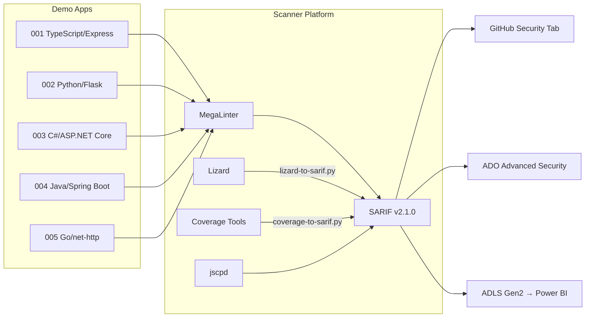

<p align="center">
  
</p>

# Code Quality Scan Demo App

[](https://github.com/devopsabcs-engineering/code-quality-scan-demo-app/actions/workflows/code-quality-scan.yml)
[](https://github.com/devopsabcs-engineering/code-quality-scan-demo-app/actions/workflows/deploy-all.yml)

Scanner platform and demo app hub for the **Code Quality** domain in the [Agentic Accelerator Framework](https://github.com/devopsabcs-engineering/agentic-accelerator-framework).

## Architecture



## Demo Apps

| App | Language | Framework | Port | Violations |
|-----|----------|-----------|------|------------|
| [cq-demo-app-001](cq-demo-app-001/) | TypeScript | Express | 3000 | High CCN, low coverage, duplication, lint |
| [cq-demo-app-002](cq-demo-app-002/) | Python | Flask | 5000 | High CCN, low coverage, duplication, lint |
| [cq-demo-app-003](cq-demo-app-003/) | C# | ASP.NET Core | 8080 | High CCN, low coverage, duplication, lint |
| [cq-demo-app-004](cq-demo-app-004/) | Java | Spring Boot | 8080 | High CCN, low coverage, duplication, lint |
| [cq-demo-app-005](cq-demo-app-005/) | Go | net/http | 8080 | High CCN, low coverage, duplication, lint |

Each app contains **15+ intentional quality violations** across 4 categories:
- **Complexity**: Functions with CCN > 10 (deeply nested conditionals)
- **Coverage**: Low test coverage (< 50% line coverage)
- **Duplication**: Copied code blocks across files
- **Lint**: Unused variables, missing types, style violations

## Quick Start

### Run Locally (Codespace)

```bash
# Pick any demo app
cd cq-demo-app-001
docker build -t cq-demo-app-001 .
docker run -p 3000:3000 cq-demo-app-001
```

### Deploy to Azure

```powershell
# 1. Setup OIDC
.\scripts\setup-oidc.ps1 -SubscriptionId "<sub-id>"

# 2. Bootstrap repos
.\scripts\bootstrap-demo-apps.ps1 -ClientId "<id>" -TenantId "<tid>" -SubscriptionId "<sid>"

# 3. Deploy all
gh workflow run deploy-all.yml
```

### Run Quality Scan

```powershell
gh workflow run code-quality-scan.yml
```

## Repository Structure

```text
code-quality-scan-demo-app/
├── .github/                    # Copilot agents, instructions, prompts, skills, workflows
├── .azuredevops/pipelines/     # ADO pipeline definitions
├── src/converters/             # SARIF converters (lizard-to-sarif.py, coverage-to-sarif.py)
├── src/config/                 # Tool configs (.mega-linter.yml, .jscpd.json)
├── scripts/                    # Bootstrap and OIDC setup scripts
├── infra/                      # ADLS Gen2 storage Bicep
├── power-bi/                   # PBIP report and semantic model
├── cq-demo-app-001/            # TypeScript/Express demo
├── cq-demo-app-002/            # Python/Flask demo
├── cq-demo-app-003/            # C#/ASP.NET Core demo
├── cq-demo-app-004/            # Java/Spring Boot demo
├── cq-demo-app-005/            # Go/net-http demo
└── docs/                       # Documentation
```

## CI/CD Workflows

| Workflow | Trigger | Description |
|----------|---------|-------------|
| `code-quality-scan.yml` | Weekly + manual | Scan all 5 apps with MegaLinter |
| `code-quality-lint-gate.yml` | PR to main | Block merge on HIGH/CRITICAL findings |
| `deploy-all.yml` | Manual | Deploy all apps to Azure (Docker containers) |
| `teardown-all.yml` | Manual + approval | Delete all Azure resources |

## SARIF Tools

| Tool | Native SARIF | Converter |
|------|:------------:|-----------|
| ESLint | ✅ | — |
| Ruff | ✅ | — |
| golangci-lint | ✅ | — |
| .NET Analyzers | ✅ | — |
| jscpd | ✅ | — |
| Lizard | ❌ | `src/converters/lizard-to-sarif.py` |
| Coverage | ❌ | `src/converters/coverage-to-sarif.py` |

## Related Repositories

- [code-quality-scan-workshop](https://github.com/devopsabcs-engineering/code-quality-scan-workshop) — Hands-on workshop with 10 labs
- [agentic-accelerator-framework](https://github.com/devopsabcs-engineering/agentic-accelerator-framework) — Framework hub

## License

MIT
