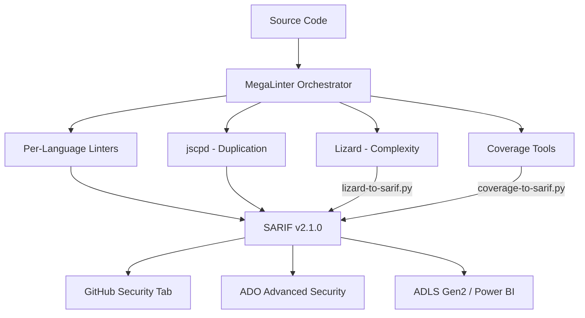

# Code Quality Scan Overview

## Architecture

The Code Quality scanner uses a **4-tool architecture** with MegaLinter as the orchestrator for maximum language coverage:



## Tool Stack

| Tool | Role | Output | SARIF Native |
|------|------|--------|:------------:|
| ESLint | TypeScript/JavaScript linting | SARIF | ✅ |
| Ruff | Python linting | SARIF | ✅ |
| golangci-lint | Go linting | SARIF | ✅ |
| .NET Analyzers | C# linting | SARIF | ✅ |
| Checkstyle/PMD | Java linting | XML → SARIF | ❌ |
| jscpd | Code duplication detection | SARIF | ✅ |
| Lizard | Cyclomatic complexity analysis | CSV → SARIF | ❌ |
| jest/pytest-cov/Coverlet/JaCoCo/go test | Test coverage | Various → SARIF | ❌ |

## Language Coverage

| Language | Linter | Coverage Tool | Demo App |
|----------|--------|---------------|----------|
| TypeScript | ESLint | jest | cq-demo-app-001 |
| Python | Ruff | pytest-cov | cq-demo-app-002 |
| C# | .NET Analyzers | Coverlet | cq-demo-app-003 |
| Java | Checkstyle/PMD | JaCoCo | cq-demo-app-004 |
| Go | golangci-lint | go test -cover | cq-demo-app-005 |

## SARIF Converters

Two converters transform tool-native output to SARIF v2.1.0:

### lizard-to-sarif.py

Converts Lizard CSV output to SARIF. Each function exceeding the cyclomatic complexity threshold (default: 10) or function length threshold (default: 50 lines) generates a SARIF result.

```text
Usage: python src/converters/lizard-to-sarif.py --input <csv> --output <sarif> [--ccn-threshold 10] [--length-threshold 50]
```

### coverage-to-sarif.py

Converts coverage reports from 5 formats to SARIF. Each file below the coverage threshold (default: 80%) generates a SARIF result.

```text
Usage: python src/converters/coverage-to-sarif.py --input <file> --format <format> --output <sarif> [--threshold 80]
Supported formats: cobertura, json-summary, lcov, jacoco, gocover
```

## Severity Mapping

| Condition | SARIF Level | Action |
|-----------|-------------|--------|
| Coverage < 50%, CCN > 20 | `error` | Block merge |
| Coverage 50-79%, CCN 11-20 | `warning` | Address in sprint |
| Coverage 80-89%, CCN 6-10 | `note` | Track for improvement |
| Coverage ≥ 90%, CCN ≤ 5 | Pass | No finding |

## CWE Mapping

| Finding Type | CWE | Description |
|-------------|-----|-------------|
| High cyclomatic complexity | CWE-1121 | Excessive McCabe Cyclomatic Complexity |
| Code duplication | CWE-1041 | Use of Redundant Code |
| Missing error handling | CWE-754 | Improper Check for Unusual Conditions |
