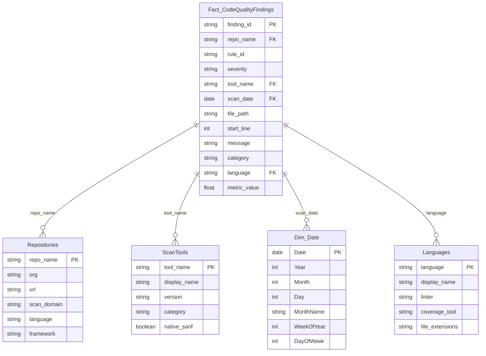

# Power BI Data Model

## Star Schema

The Code Quality Power BI report uses a star schema with one fact table and four dimension tables.

## Tables

### Fact_CodeQualityFindings

One row per finding from scan results. Source: ADLS Gen2 JSON files uploaded by `scan-and-store.ps1`.

| Column | Type | Description |
|--------|------|-------------|
| finding_id | string | Unique finding identifier (GUID) |
| repo_name | string | Source repository name |
| rule_id | string | Rule or check identifier (e.g., `ccn-exceeded`) |
| severity | string | CRITICAL, HIGH, MEDIUM, LOW |
| tool_name | string | Scanning tool (ESLint, Ruff, Lizard, etc.) |
| scan_date | date | Date of the scan |
| file_path | string | Relative file path |
| start_line | int | Line number of finding |
| message | string | Finding description |
| category | string | Finding category (complexity, coverage, duplication, lint) |
| language | string | Programming language |
| metric_value | float | Numeric metric (CCN value, coverage %, etc.) |

### Repositories (Shared Dimension)

Repository metadata with `scan_domain` column for cross-domain reporting.

| Column | Type | Description |
|--------|------|-------------|
| repo_name | string | Repository name (PK) |
| org | string | GitHub organization |
| url | string | Repository URL |
| scan_domain | string | Domain identifier (`CodeQuality`) |
| language | string | Primary language |
| framework | string | Framework name |

### ScanTools

Tool metadata for filtering and grouping.

| Column | Type | Description |
|--------|------|-------------|
| tool_name | string | Tool name (PK) |
| display_name | string | Display-friendly name |
| version | string | Tool version |
| category | string | Tool category (linter, coverage, complexity, duplication) |
| native_sarif | boolean | Whether tool produces native SARIF |

### Dim_Date

DAX-generated calendar table for time intelligence.

### Languages

Programming language metadata linking to linter and coverage tool choices.

## Data Source

- **Connection**: Azure Data Lake Storage Gen2 via `AzureStorage.DataLake()`
- **Authentication**: OAuth (Organizational Account)
- **Path pattern**: `{yyyy}/{MM}/{dd}/{appId}-{tool}.json`
- **Endpoint**: `https://{storageAccount}.dfs.core.windows.net/scan-results`

## Report Pages

| Page | Description |
|------|-------------|
| Quality Overview | Executive summary with KPIs, severity distribution, trend sparklines |
| Coverage Details | Per-file coverage heatmap, threshold compliance |
| Complexity Analysis | Function complexity distribution, top offenders |
| Duplication Report | Clone detection results, duplication density |
| Repository Deep Dive | Per-repo drill-down with all findings |
